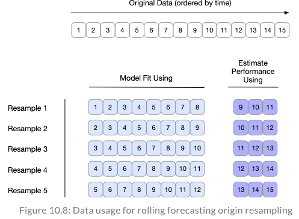

```{css, echo=FALSE} 
@media print { # print out incremental slides; see https://stackoverflow.com/questions/56373198/get-xaringan-incremental-animations-to-print-to-pdf/56374619#56374619
  .has-continuation {
    display: block !important;
  }
}
```

```{r setup, include=FALSE}
# figures formatting setup
options(htmltools.dir.version = FALSE)
library(knitr)
opts_chunk$set(
  prompt = T,
  fig.align="center", #fig.width=6, fig.height=4.5, 
  # out.width="748px", #out.length="520.75px",
  dpi=300, #fig.path='Figs/',
  cache=T, #echo=F, warning=F, message=F
  engine.opts = list(bash = "-l")
  )

## Next hook based on this SO answer: https://stackoverflow.com/a/39025054
knit_hooks$set(
  prompt = function(before, options, envir) {
    options(
      prompt = if (options$engine %in% c('sh','bash')) '$ ' else 'R> ',
      continue = if (options$engine %in% c('sh','bash')) '$ ' else '+ '
      )
})
```


# **Rsample** package
.pull-left[
Useful to split your data into testing and training subsets:

Why do we care? 
- Having multiple splits allows us to construct and compare different models with different (combinations of) parameters.
- The final model is only used on the test set once, so we want to make sure that the final model is the best way of explaining the data.
  - If we run multiple models on the test set, we start to optimise our model to the test set instead of focusing on the model's general ability to explain the dataset. 
]

.pull-right[
<div align="center">

</div>
]
---
# **Different ways of splitting your dataset**


.pull-left[
- Initial split (training vs testing) --> initial_split(strata = desired column, prop = 0.x)
- V-fold
- Bootstraps
- Rolling forecast
]

.pull-right[
<div align="center">

</div>
]
---
# V-fold


<div align="center">

</div>

---
# Bootstrapping

.pull-left[
- Analysis sets are sampled from training dataset **with** replacement.
  - Has the same size as the training dataset
- Analysis vs Assessment (Out-of-the bag) split
  - Why does the assessment set differ in size?
- Function: bootstraps(dataset, times = x).

- (insert picture from practice example to show output of a bootstrap)
]


.pull-right[
<div align="center">

</div>
]
---
# Rolling Forecasting Origing Resampling
.pull-left[
- If our dataset has a temporal component, simply random sampling can disrupt the model in estimating patterns.
  - Solution: fit_resamples(formula, resamples, ...)
- We set the size of the analysis and assessment sets. The first sample follows this division, the second iteration takes the same data size but shifts by a specified number. 
- Alternatively we don't have to shift by one day but also by one week or more. 
]

.pull-right[
<div align="center">

</div>
]
---
# **yardstick** package

Contains tools for computing statistical performance metrics

- Consistent Syntax 
- Wide Range of Metrics (43)
- Grouped calculations (e.g. `demographic_parity()`)
- Customization (e.g. `new-metric()` see more on [custom performance metrics](https://www.tidymodels.org/learn/develop/metrics/))

`metrics(data, truth, estimate, ..., na_rm = TRUE, options = list())`

[Manual](https://cran.r-project.org/web/packages/yardstick/yardstick.pdf)

<div align="center">

</div>


---
# Classification metrics

Measuring the accuracy in prediction of categories

| Function         | Name                              | Interpretation                   |
|------------------|-----------------------------------|----------------------------------|
| accuracy()       | Accuracy                          | 0 < x < 1, the higher the better |
| f_meas()         | F-measure                         | 0 < x < 1, the higher the better |
| kap()            | Cohen's Kappa                     | -1 < x < 1, the closer to 1 the better |
| mcc()            | Matthews Correlation Coefficient   | -1 < x < 1, the closer to 1 the better |
| npv()            | Negative Predictive Value         | 0 < x < 1, the higher the better |
| ppv()            | Positive Predictive Value         | 0 < x < 1, the higher the better |
| precision()          | Precision                   | 0 < x < 1, the higher the better   |
| recall()             | Recall                      | 0 < x < 1, the higher the better   |
| spec()               | Specificity                 | 0 < x < 1, the higher the better   |
| roc_auc()            | Area Under ROC Curve         | 0.5 < x < 1, the higher the better |
| pr_auc()             | Area Under PR Curve          | 0 < x < 1, the higher the better   |


---
# Regression metrics

Measuring the accuracy in prediction of continuous numeric values

| Function              | Name                         | Interpretation                     |
|-----------------------|------------------------------|------------------------------------|
| ccc()                 | Concordance Correlation Coefficient | -1 < x < 1, the closer to 1 the better |
| iic()                 | Index of Ideality of Correlation | 0 < x < 1, the higher the better    |
| **mae()**                 | Mean Absolute Error           | 0 < x < $\infty$, the lower the better     |
| mape()                | Mean Absolute Percentage Error | 0 < x < $\infty$, the lower the better    |
| msd()                 | Mean Squared Deviation        | 0 < x < $\infty$, the lower the better     |
| poisson_log_loss()    | Poisson Log Loss              | 0 < x < $\infty$, the lower the better     |
| **rmse()**                | Root Mean Squared Error       | 0 < x < $\infty$, the lower the better     |
| rpd()                 | Relative Percent Difference    | 0 < x < 1, the lower the better     |
| **rsq_trad()**            | Traditional R-squared         | 0 < x < 1, the closer to 1 the better |
| smape()               | Symmetric Mean Absolute Percentage Error | 0 < x < 1, the lower the better |

---
# For further investigation

Our links here
