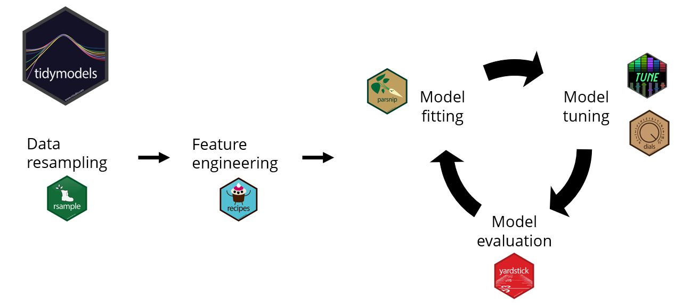
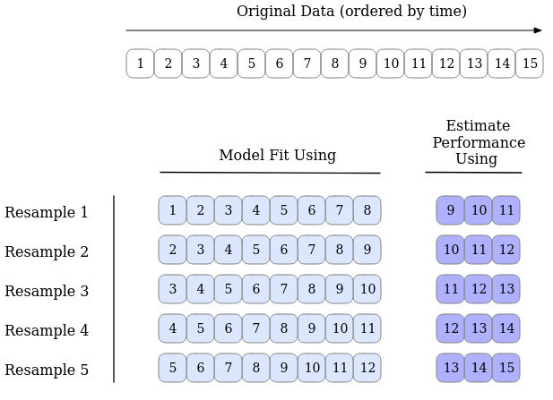

```{css, echo=FALSE} 
@media print { # print out incremental slides; see https://stackoverflow.com/questions/56373198/get-xaringan-incremental-animations-to-print-to-pdf/56374619#56374619
  .has-continuation {
    display: block !important;
  }
}
.large-code { font-size: 25px; }

.large-center {
    text-align: center;
    font-size: 20px;
}
```

# Welcome to our Workshop on tidymodels!

1. [Tidymodels: A Brief Overview](#tidymodels)
2. [Preprocesing with `recipes`](#recipes)
4. [Splitting Your Data-Set with `rsample`](#Rsample)
3. [Modelling in R with `parsnip`](#parsnip)
5. [Evaluating Model Performance using `yardstick`](#Yardstick)
7. [Futher Resources](#resources)

---
name: tidymodels

# tidymodels
- `tidymodels` is a __collection of packages__
- each package is targeted at a specific part of the modelling process

<div align="center">

<a href="https://rpubs.com/chenx/tidymodels_tutorial">rpubs.com</a>
</div>

---
# Overview of tidymodels packages:

.pull-left[

## Goal of each package:

1. __`rsamples`__ - to split the data into training and testing-sets
2. __`recipes`__ - to prepare the data with pre-processing
3. __`parsnip`__ - to specify and fit a model to the data
4. __`yardstick`__ and `tune` - to evaluate model performance
5. `workflows` - to combine `recipe` and `parsnip` objects into a workflow 
6. `tune` and `dials` - to optimize models  
7. `broom` - to increase the readability of model output
8. ...

For another great overview of how the packages complement each other and fit within the whole modelling process, click [here](https://rpubs.com/chenx/tidymodels_tutorial).
]

.pull-right[
<div align="center">

<a href="https://rpubs.com/chenx/tidymodels_tutorial">rpubs.com</a>
</div>
]

---
name: recipes
# Preprocessing and Feature Engineering

- __Data needs to be clean__
- Data needs to adhere to some model-specific rules and assumptions

--

> __Feature Engineering__
> The process of transforming raw data into features well suited-for modelling.

--

- What does this entail?
    - Removing `NA`'s -> how to deal with them? Throw data away? Impute with mean/median/...?
    - Transform numeric values (`log`, `sqrt`,...)
    - Re-scale numeric values
    - Deal with nominal/string values
    - ....
---
# Pre-Processing with _recipes_

- While all of this can be coded by hand, `recipes` make our life's easier by providing the necessary operations in a __standardized__ way
- Feels familiar to `tidyverse` users and is compatible with `dplyr` 

.large-code[

```r
recipe(outcome ~ ., data = training_data) %>%
      # remove features with high correlation between them
      step_corr(all_predictors()) %>%
      step_string2factor(all_string_predictors()) %>%
      step_impute_mean(all_numeric_predictors()) %>%
      step_mutate(<dplyr call>)
```
]

--

- Can be reused easily, as we can rely on roles/types and not specific variable names
--

- Use
    - __`prep()`__ to calculate pre-processing parameters (e.g., mean to impute)
    - __`bake()`__ to apply the pre-processing steps to the actual data
---
name: Rsample

# Splitting Your Data-Set with _rsample_

.pull-left[
Useful to split your data into __testing__ and __training__ subsets:

### Why do we care?

- Model should explain the data, not memorize it
- Having multiple splits allows us to construct and compare different models with different (combinations of) parameters
<!-- QUESTION: The following two points I do not understand - fitting the final model multiple times would not change the outcome, no? -->
<!-- Does this in the end mean the same thing as the first point I sneakily added? -->
- The final model is only used on the test set once, so we want to make sure that the final model is the best way of explaining the data.
  - If we run multiple models on the test set, we start to optimize our model to the test set instead of focusing on the model's general ability to explain the data-set.
]

.pull-right[
<div style="top: 30%;position: absolute;">

<a href="https://www.tmwr.org/resampling">tmwr.org</a>

</div>
]
---
# Different Ways of Splitting Your Data-Set

.pull-left[
- Initial split (__training__ vs __testing__)
```r
initial_split(
    dataset,
    prop = 0.x,
    strata = <desired column>)
```
- Cross Validation and V-fold
- Bootstraps
- Rolling Forecast
]

.pull-right[
<div style="top: 30%;position: absolute;">

</div>
]
---
# Cross Validation and V-fold

.pull-left[
- The data is split into `v`-sets of data called __folds__ of equal size.  
- Function: `vfold_cv(dataset, v = x)`
  - E.g., `x = 3`, the data is split in three different ways with 2/3 in analysis en 1/3 is assessment.
  - The default is set to 10, this is still manageable but enough to produce robust results. 
- Output is a `tibble` containing `lists`, each list contains information on how the data is split.
  - We can unpack the first column to get our analysis and assessment set. 
- For more information and variants of cross validation check out: [Tidy Modelling with R Ch 10](https://www.tmwr.org/resampling).
]

.pull-right[
<div style="top: 30%;position: absolute;">

<a href="https://www.tmwr.org/resampling">tmwr.org</a>
</div>
]
---
# Bootstrapping

.pull-left[
- Analysis sets are sampled from data-set **with** replacement.
  - Has the same size as the initial data-set
- Analysis vs Assessment (Out-of-the bag) split
<!-- QUESTION: Is this a rhetoric remark?  -->
  - Why does the assessment set differ in size?
- Function: `bootstraps(dataset, times = x)`
]

.pull-right[
<div style="top: 30%;position: absolute;">

<a href="https://www.tmwr.org/resampling">tmwr.org</a>
</div>
]
---
<!-- QUESTION: You are sure that you come out with the allotted time? This is the thing I would propose to cut out first to be honest; just as its the most advanced.... -->
# Rolling Forecasting Origing Resampling

.pull-left[
- If our data-set has a __temporal__ component, simply random sampling can disrupt the model in estimating patterns.
  - Solution:</br>
  `fit_resamples(formula, resamples, ...)`
- We set the size of the analysis and assessment sets. The first sample follows this division, the second iteration takes the same data size but shifts by a specified number. 
]

.pull-right[
<div style="top: 30%;position: absolute;">

<a href="https://www.tmwr.org/resampling">tmwr.org</a>
</div>
]
---
name: parsnip

# Modelling in R

- Many different models to choose from
    - Type of model to use is an important decision, which needs to grounded __in theory__
- For each type of model, multiple implementations are available
---
# Modelling in R

- Consider these examples for linear regression models:

- `stat::lm()`
```r
lm(formula, data, [...], ...)
```
--

- `glmnet::glm()`
```r
glmnet(x, y, [...], standardize = TRUE, intercept = TRUE, ...)
```
--

- `sparklyr::ml_linear_regression()`
```r
ml_linear_regression(x, formula = NULL, fit_intercept = TRUE, [...], standardization = TRUE, [...], ...)
```
---
# Modelling in R
.pull-left[
- Syntax differs
    - in argument order
    - in argument names
    - ...
    

]
--
.pull-right[
- __`parsnip` to the rescue__!


]
---
# parsnip

- Package that aims to unify signatures of different models in `R`
- One familiar approach to **many different types of models**
    - [Searchable list](https://www.tidymodels.org/find/parsnip/) of all models available through `parsnip`

.large-code[
```
  linear_reg() %>% 
      set_engine("lm") %>% 
      fit(dependent ~ pred_one + pred_two, data = data)
```
]
--

- `linear_reg()`, `decision_tree()`, `logistic_reg()`, ...
- `set_engine` to specify which implementation to use
- Unified way of fitting a model to a data-set: __`fit()`__
- Unified way of predicting the outcome on a data-set: __`predict(fitted_model, data)`__

---
name: Yardstick

# Evaluating Model Performance with **yardstick**

Contains tools for computing statistical performance metrics

.pull-left[
- Consistent Syntax 
- Wide Range of Metrics (43)
- Grouped calculations (e.g. `demographic_parity()`)
- Customization (e.g. `new-metric()`, see more on [custom performance metrics](https://www.tidymodels.org/learn/develop/metrics/))

```r
metrics(
    data,
    truth,
    estimate, 
    ..., 
    na_rm = TRUE,
    options = list()
)
```

[Find more Information in the Documentation.](https://cran.r-project.org/web/packages/yardstick/yardstick.pdf)
]
.pull-right[
<div align="center">

</div>
]

---
<!-- QUESTION: Do you still want to add some explanation for anything on these? Or will you say that during the presentation? -->
# Classification Metrics

Measuring the accuracy in prediction of categories

| Function         | Name                              | Interpretation                   |
|------------------|-----------------------------------|----------------------------------|
| accuracy()       | Accuracy                          | 0 < x < 1, the higher the better |
| f_meas()         | F-measure                         | 0 < x < 1, the higher the better |
| kap()            | Cohen's Kappa                     | -1 < x < 1, the closer to 1 the better |
| mcc()            | Matthews Correlation Coefficient   | -1 < x < 1, the closer to 1 the better |
| npv()            | Negative Predictive Value         | 0 < x < 1, the higher the better |
| ppv()            | Positive Predictive Value         | 0 < x < 1, the higher the better |
| precision()          | Precision                   | 0 < x < 1, the higher the better   |
| recall()             | Recall                      | 0 < x < 1, the higher the better   |
| spec()               | Specificity                 | 0 < x < 1, the higher the better   |
| roc_auc()            | Area Under ROC Curve         | 0.5 < x < 1, the higher the better |
| pr_auc()             | Area Under PR Curve          | 0 < x < 1, the higher the better   |


---
# Regression Metrics

Measuring the accuracy in prediction of continuous numeric values

| Function              | Name                         | Interpretation                     |
|-----------------------|------------------------------|------------------------------------|
| ccc()                 | Concordance Correlation Coefficient | -1 < x < 1, the closer to 1 the better |
| iic()                 | Index of Ideality of Correlation | 0 < x < 1, the higher the better    |
| **mae()**                 | Mean Absolute Error           | 0 < x < $\infty$, the lower the better     |
| mape()                | Mean Absolute Percentage Error | 0 < x < $\infty$, the lower the better    |
| msd()                 | Mean Squared Deviation        | 0 < x < $\infty$, the lower the better     |
| poisson_log_loss()    | Poisson Log Loss              | 0 < x < $\infty$, the lower the better     |
| **rmse()**                | Root Mean Squared Error       | 0 < x < $\infty$, the lower the better     |
| rpd()                 | Relative Percent Difference    | 0 < x < 1, the lower the better     |
| **rsq_trad()**            | Traditional R-squared         | 0 < x < 1, the closer to 1 the better |
| smape()               | Symmetric Mean Absolute Percentage Error | 0 < x < 1, the lower the better |

---
# Regression Metrics

#### Mean Absolute Error (MAE)
$$
MAE = \frac{1}{n} \sum_{i=1}^{n} |y_i - \hat{y}_i|
$$

#### Root Mean Squared Error
$$
RMSE = \sqrt{\frac{1}{n} \sum_{i=1}^{n} (y_i - \hat{y}_i)^2} \
$$

#### R squared
```{r, echo=FALSE}
# Define the formula in LaTeX format
latex_formula <- "R^2 = 1 - \\frac{\\sum_{i=1}^{n} (y_i - \\hat{y_i})^2}{\\sum_{i=1}^{n} (y_i - \\bar{y})^2}"

# Output the LaTeX formula with custom styling
knitr::asis_output(sprintf("<div class='large-center'>$$ %s $$</div>", latex_formula))
```

- $n$ = Number of observations
- $y_i$ = Actual value for observation $i$
- $\hat{y}_i$ = Predicted value for observation $i$
- $\bar{y}$ = Mean of the dependent variable

---
name: resources

# Further Resources and Sources

- 🌐 Website of the [`tidymodels`](https://www.tidymodels.org/) package, including documentation and guides
    - `tidymodels` consists of many more packages than we could cover in this session!
- 📖 [Tidy Modelling with R](https://www.tmwr.org/)
- 📺 [Get started with tidymodels and classification of penguin data by Julia Silge](https://www.youtube.com/watch?v=z57i2GVcdww)
- 📺 [tidymodels: Adventures in Rewriting a Modeling Pipeline - posit::conf(2023)](https://www.youtube.com/watch?v=R7XNqcCZnLg)
- 📜 [A Gentle Introduction to tidymodels](https://rviews.rstudio.com/2019/06/19/a-gentle-intro-to-tidymodels/)
- 📜 [Tidymodels Ecosystem Tutorial](https://rpubs.com/chenx/tidymodels_tutorial)

